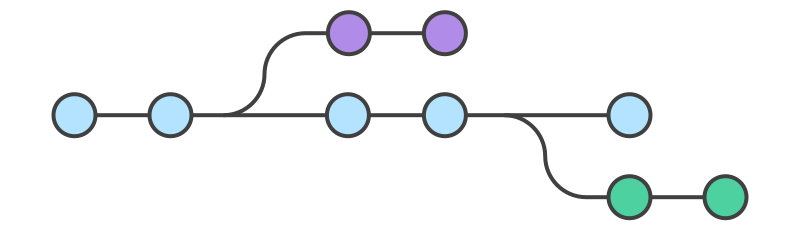
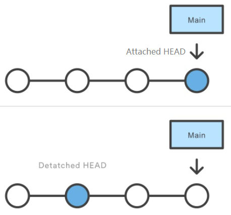

# git checkout

- <https://zhuanlan.zhihu.com/p/465954849>

****************************

## Index

1. [git 的检出](#git_checkout)
2. [detached HEAD](#detached-head) \
    [2.1 Introduction to git detached head](#introduction-to-git-detached-head) \
    [2.2 Git detached head workflow](#git-detached-head-workflow) \
    [2.3 Setting up the lab environment](#setting-up-the-lab-environment) \
    [2.4 How to work with git detached head](#how-to-work-with-git-detached-head) \
    [2.5 Summary](#summary)


## 1 git 的检出<span id="git_checkout"></span>

创建并切换分支： 
```batch
    git checkout -b mybranch
```



在 `Git` 术语中，`checkout` 的意思就是对于一种实体的不同版本之间进行切换的操作。`git checkout` 
命令可以用于三种不同的实体：文件，`commit`，以及分支。

`checkout 分支` 类似于检出一个分支中的某次旧的 `commit`；然而，新的变更会被存储在项目的历史中，
这也就意味着这并不是一个只读的操作。

`git checkout` 命令有时候会跟 `git clone` 命令相混淆。两个命令中最为显著的差别在于，`git clone` 
用于从远程仓库获取代码，而 `git checkout` 则用来在本地系统中业已存在的代码库中切换不同的版本。

`checkout` 一个分支，会更新当前的工作空间中的文件，使其与检出分支的 `commit` 
版本状况保持一致。这之后工作区中的所有变更都会被记录在 `checkout` 
出来的那个分支上。因此 `checkout` 操作其实就是**挑选工作分支**，被称为**检出分支**。

`checkout` 一个本地分支，然后将其硬重置为远程分支的最新 `commit`:
```batch
git checkout -b ＜branchname＞
git reset --hard origin/＜branchname＞
```

[Back to index](#index)


## 2 detached HEAD

<https://www.golinuxcloud.com/git-detached-head-examples/>

游离状态的 HEAD

------

### 2.1 Introduction to git detached head

`HEAD` 是 `Git` 用来引用当前快照的指针。`git checkout` 命令将 `HEAD` 
指针更新为指向特定分支或者 `commit`。当它指向一个分支时，没什么问题，但当 
`checkout` 一个特定的 `commit`，就会将 `HEAD` 指针变成一个游离的指针状态。

当进入这种游离状态时，`Git` 会警告你当前处于游离状态，你所做的任何更改也都游离于你整个项目的开发流程。
如果执意要在游离状态开展新的修改，这些修改将不会被允许再合并回任何分支。
然后当你没有办法只能切换到其他分支时，这部分修改也无法被带回到新的分支。



开发工作应该始终发生在一个分支上――而不是一个游离状态的 `HEAD` 上。
如果你只是为了去看看某一个过去的提交，则无所谓是否处于游离状态。

[Back to index](#index)


### 2.2 Git detached head workflow


[Back to index](#index)


### 2.3 Setting up the lab environment


[Back to index](#index)


### 2.4 How to work with git detached head


[Back to index](#index)


### 2.5 Summary


[Back to index](#index)


