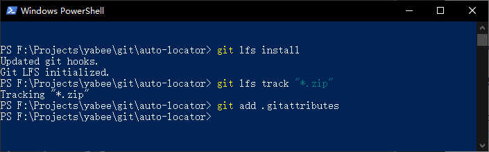

# Git Large File Storage

<https://git-lfs.github.com/>

*********************************************

Git Large File Storage (LFS) replaces large files such as audio samples, videos, 
datasets, and graphics with text pointers inside Git, while storing the file contents 
on a remote server like GitHub.com or GitHub Enterprise.

## Step 1

Set up Git LFS for your user account by running:
```batch
git lfs install
```
You only need to run this once per user account.

## Step 2

In each Git repository where you want to use Git LFS, select the file types you'd like 
Git LFS to manage (or directly edit your .gitattributes). You can configure additional 
file extensions at anytime.
```batch
git lfs track "*.zip"
```
Now make sure .gitattributes is tracked:
```batch
git add .gitattributes
```
Note that defining the file types Git LFS should track will not, by itself, convert any 
pre-existing files to Git LFS, such as files on other branches or in your prior commit 
history. To do that, use the 
[git lfs migrate[1]](https://github.com/git-lfs/git-lfs/blob/main/docs/man/git-lfs-migrate.1.ronn?utm_source=gitlfs_site&utm_medium=doc_man_migrate_link&utm_campaign=gitlfs) 
command, which has a range of options designed to suit various potential use cases.


